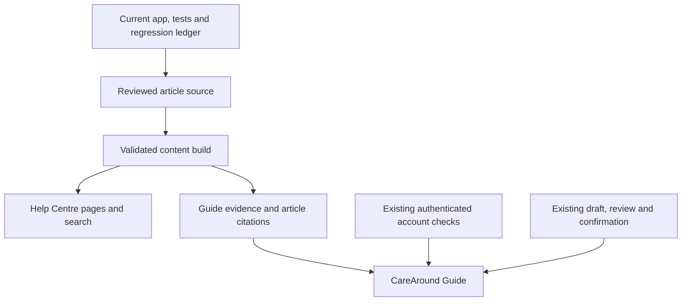

# CareAround Help Centre and AI Guide — unified project plan

Date: 2 October 2026 (Asia/Singapore)

Status: **Implementation goal active. Local candidate verified; owner-approved progressive review replaces up-front bulk human scoring. Exact release approval remains open.**

## 1. Intended outcome

Create a comprehensive CareAround Help Centre and improve the AI Guide using one reviewed product-knowledge library. People should receive the same accurate instructions whether they browse an article, search for help, or ask the Guide conversationally.

The Help Centre follows CareAround's own tasks, roles and privacy boundaries. Atlist was an example of organised help, not a design or feature specification to copy.

Success means that the Guide chooses the correct CareAround workflow, supplies complete supported instructions, links the relevant article, and uses authenticated tools for current-account questions. The product's existing permissions and explicit action confirmations remain authoritative.

The user activated the implementation goal after reviewing this plan. That activation authorises implementation and local verification in an isolated worktree. Commit, push and production deployment still require explicit release approval. Live model calls, budget renewal/reset and production credential changes require their applicable separate authorisation.

## 2. Grounded baseline and current problem

- The active root is `/Users/sweetbuns/CareAroundSG`, on `codex/documentation-refresh-20260905`, with unrelated unfinished changes. Preserve them.
- The recorded released source is `b8345be4d2f7a097e81cb03eef64b473abd0cec9`. Its attached checkout, `/Users/sweetbuns/.codex/worktrees/guide-production-release/CareAroundSG`, was clean during planning. Recheck the current deployed/source baseline before implementation; this plan does not freeze production forever.
- The existing `/help` workspace contains Guide, Inbox, Updates, Report a problem, guest report recovery and permitted support review. Add Help Centre entry points without replacing those flows.
- Guide knowledge currently includes `GUIDE_TOPICS` and a separate detailed fact catalogue. Written draft guides contain useful procedures that are more complete than some served Guide facts.
- Existing local guides and the Obsidian product-and-system map are review seeds and coverage aids. They are not automatic proof of current behaviour.
- Observed failure: **“how can i add places that are not found in carearound SG”**, asked from **My Maps**, received public Place creation instructions. The correct private-map workflow is **Personal place**.
- The prior credential-free replay showed that the current route accepts the observed incorrect model reply with a recognised source ID. Page context reaches both model stages. The Personal place candidate exists, but its reviewed summary lacks the complete map-location procedure. This is fixture proof of an acceptance weakness, not a new live-model evaluation.
- Existing green regression suites do not prove that all generated answers are semantically correct. This project adds explicit answer-quality acceptance.

Relevant source seams in the released checkout:

| Concern | Existing location | Planned treatment |
| --- | --- | --- |
| Help/support shell | `client/src/pages/SupportHubPage.jsx:11-94` | Keep existing tabs, identity resets and recovery behaviour |
| Coarse context | `client/src/features/support/guideAssistantContext.js` | Keep page families; do not send map names, IDs, tokens or private page contents |
| Basic topics | `server/src/utils/guideKnowledge.js` | Thin compatibility adapter into shared content |
| Detailed reviewed facts | `server/src/utils/guideOracleKnowledge.js` | Preserve IDs, qualifications and intent helpers; migrate content separately |
| Retrieval | `guideFactRetrieval.js`, `guideSemanticRetrieval.js` | Select permitted, relevant sections; protect domain distinctions |
| Answer construction | `server/src/utils/guideChat.js` | Prefer complete approved procedures; test meaning, not citation shape alone |
| Account reads | `server/src/routes/guide.js` and its account loaders | Keep server scoping and precedence over general product answers |
| Actions | Existing Guide action routes and client review flows | Reuse supported draft/review/confirm behaviour; add no new write capability |

## 3. Scope and blast radius

### In scope

1. Inventory current product tasks and existing help facts, including provider/admin tasks.
2. Establish a reviewed article format and a single authoring source.
3. Build accessible Help Centre browsing, text search and stable article links in the app.
4. Generate Guide evidence from the same source and connect citations to article sections.
5. Improve workflow selection, complete procedural responses and appropriate clarification/fallback.
6. Add content validation, answer evaluation, relevant regression checks and a maintenance process.
7. Prepare a tested release candidate and, when separately authorised, verify the deployed release.

### Boundaries

- Keep Discover ranking/filtering, saved-resource behaviour, My Map rendering, Detailed map assets, sharing rules, Calendar behaviour and resource forms unchanged.
- Change no production secrets, database schema, account roles or resource permissions as a side effect.
- Do not extend the model pilot, reset its counter, introduce subscriptions or assume unlimited AI usage.
- Add no new actions beyond the existing supported Guide capabilities.
- Do not ingest private account data, support conversations, raw operational documents or an entire Obsidian vault into public help/model context.
- Keep the separately managed `carearound.sg` apex outside this app project. The initial Help Centre belongs to `app.carearound.sg`.
- Publish English first, reflecting the current Guide/support language. Other app languages must retain working navigation and a clear English-content fallback. Translated instructions require review before publication.

The main risks are changing source/fact identity during migration, confusing private and public workflows, breaking `/help` navigation, exposing restricted guidance in public bundles, and relaxing account/action checks. Split these into narrow milestones and prove compatibility before editorial expansion.

## 4. One knowledge library, two consumers

### Proposed implementation defaults

These paths are proposed, not files already implemented:

| Path | Responsibility |
| --- | --- |
| `content/help/articles/*.json` | Human-readable structured article records, including prose and ordered steps |
| `content/help/schema.json` | Validate article shape and required metadata |
| `content/help/manifest.json` | Categories, article ordering, aliases and stable legacy topic/fact mappings |
| `scripts/build-help-content.mjs` | Deterministic validation and generation; no AI call |
| `client/src/generated/helpArticles.json` | Only approved public reading/search content |
| `server/src/generated/helpKnowledge.js` | Reviewed retrieval sections and server-only review/access metadata |
| `client/src/features/help/` | Browsing, search, article view and related-article links |
| `server/src/routes/helpArticles.js` | Authenticated delivery of permitted restricted article lists, search results, detail and section citations |

Use structured records and safe React rendering first. Avoid a new CMS, raw HTML rendering or a new publishing service for this release. If inspection during implementation reveals an existing suitable renderer, reuse it while preserving the same content contract.

Suggested article fields:

- Stable `id`, `slug`, `title`, `summary`, category and related article IDs.
- `audiences` for navigation organisation, and a separate `visibility` rule for actual delivery restrictions.
- Applicable coarse page families and common question aliases.
- Sections with stable IDs, prerequisites, ordered steps, expected result, exceptions, privacy consequences and troubleshooting.
- Stable legacy Guide fact IDs where applicable. Bind citations to the relevant section, not just a loosely related whole article.
- Review metadata: `draft`, `approved` or `retired`; verifier/owner, reviewed date, source revision and internal evidence references.

An audience label does not grant access. Restricted material must be filtered on the server using existing access predicates and omitted entirely from public static bundles. A hidden client menu is insufficient protection. Public general permission explanations may be readable without exposing operational/private material.

Public payloads expose appropriate article titles, content, links and reviewed dates. They omit internal file spans, credential details, private records and operational notes. Rendered article metadata may say who the instructions apply to; it must not infer the viewer's current permissions.

### Restricted article delivery contract

Approved public articles use the static public corpus. Restricted articles use the existing authenticated API client and server middleware, with proposed `GET /api/help/articles`, `GET /api/help/articles/search?q=...` and `GET /api/help/articles/:slug` routes. These are proposed interfaces, not working endpoints.

Apply one server-side visibility policy consistently to list results, search results, article detail, requested sections, related-article suggestions and Guide retrieval/citations. Resolve the existing viewer capability on each request; never trust a role supplied by the client or a model. Unauthorized requests must not disclose restricted titles, excerpts, counts or source metadata. A citation is not permission to open its article.

Restricted responses use `Cache-Control: private, no-store` and must be excluded from CDN, service-worker and persistent local caches. Clear restricted article/search state on account or impersonation changes using existing identity-reset patterns. Recheck delivery after access revocation. If an appropriate current capability predicate cannot be established for an article, leave that article draft until its visibility rule is reviewed; do not add a new role or weaken authentication to make it visible.

### Routes and compatibility

Proposed defaults: `/help-centre` for browsing and `/help-centre/:slug` for articles, with stable section anchors. Confirm collisions and router guards before implementation.

Retain `/help`, its query parameters and deep links. Add a small Browse help link in the existing support shell and appropriate Guide/article entry points. Keep app actions pointing to their existing destinations; add a separate `articleRoute` for reading evidence. A source citation must not silently become a Create, Save or Publish action.

### Migration strategy

1. Record the existing topic/fact contract, IDs, order, text, qualifiers, destinations and fallback behaviour.
2. Move authoring content into the new library through narrow adapters. Preserve the current retrieval contract and stable IDs initially; leave permission and intent helpers in their existing modules.
3. Prove generated-content parity before changing instructions. Temporary migration records must have an explicit removal checklist.
4. Review and expand articles in batches. Map every served product fact to an approved article section; account/tool responses remain separate.
5. Connect citations and contextual links, then improve workflow routing and answer construction.
6. Remove independent authoring copies after parity and quality checks pass. Generated client/server representations are outputs, not separate editorial sources.

Do not silently discard existing useful Guide facts to satisfy an article count. The inventory must identify every current fact as mapped, merged, reviewed for retirement or an explicitly tracked coverage gap.

## 5. Content inventory and coverage

The following 48 candidate articles make the project concrete. Titles, splits and availability must be verified in Phase 1; this list does not assert that every candidate workflow is currently offered to every account.

| ID | Candidate article | Initial delivery batch |
| --- | --- | --- |
| HC-01 | What CareAround helps you do | Essential |
| HC-02 | Sign in and find your way around | Essential |
| HC-03 | Find a resource by name, category or location | Essential |
| HC-04 | Read resource details and check information with the provider | Essential |
| HC-05 | Save and unsave a resource | Essential |
| HC-06 | Understand Saved Resources, My Maps, My Places and managed resources | Essential |
| HC-07 | Create a My Map | Essential |
| HC-08 | Add or remove resources in an existing map | Essential |
| HC-09 | Add a missing location as a Personal place on your map | Essential |
| HC-10 | Verify a Personal place address or use a genuine point without an address | Essential |
| HC-11 | Reuse, edit, detach or delete a Personal place | Essential |
| HC-12 | Open Map Studio and save a view on desktop or mobile | Essential |
| HC-13 | Print or export your own map | Essential |
| HC-14 | Publish, update or stop sharing a map | Essential |
| HC-15 | Add private map notes and review shared notes | Standard-user expansion |
| HC-16 | Add annotations and review their sharing behaviour | Standard-user expansion |
| HC-17 | Understand missing pins, list-only resources, filters and map framing | Standard-user expansion |
| HC-18 | Download Map Assets Excel and understand its contents | Standard-user expansion |
| HC-19 | View or copy a Shared Map | Standard-user expansion |
| HC-20 | Download a town map versus exporting your own My Map | Standard-user expansion |
| HC-21 | Understand which activities appear in Care Calendar | Standard-user expansion |
| HC-22 | Add a session to My Plans and arrange booking with the provider | Standard-user expansion |
| HC-23 | Review schedule changes, cancellations and Updates | Standard-user expansion |
| HC-24 | Manage a dated personal reminder, if supported | Standard-user expansion |
| HC-25 | Update profile and location preferences | Standard-user expansion |
| HC-26 | Choose language, contrast and text size | Standard-user expansion |
| HC-27 | Verify or link a phone using the available account controls | Standard-user expansion |
| HC-28 | Link a Place membership using its approved QR code or link | Standard-user expansion |
| HC-29 | Ask the Guide, read its sources and use help when AI is unavailable | Standard-user expansion |
| HC-30 | Check your own current account access through the Guide | Standard-user expansion |
| HC-31 | Review and confirm a supported Guide action | Standard-user expansion |
| HC-32 | Report a problem, use Inbox and recover a guest report | Standard-user expansion |
| HC-33 | Understand assigned resource permissions and missing controls | Provider/staff |
| HC-34 | Create or maintain a public Place | Provider/staff |
| HC-35 | Create or maintain a Programme/service | Provider/staff |
| HC-36 | Maintain Programme schedules and sessions | Provider/staff |
| HC-37 | Change resource visibility and distinguish hiding from deleting | Provider/staff |
| HC-38 | Use Offering templates and place versions | Provider/staff |
| HC-39 | Create or manage public Resource Groups | Provider/staff |
| HC-40 | Review extracted flyer or calendar drafts before saving | Provider/staff |
| HC-41 | Review translations and preserve approved wording | Provider/staff |
| HC-42 | Use scoped workbook import/export | Provider/staff/admin, verified per workflow |
| HC-43 | Use permitted restricted notes and files | Provider/staff, restricted where required |
| HC-44 | Use Organisation Workspace and governance access | Organisation/admin |
| HC-45 | Understand coordination groups versus public Resource Groups | Organisation/admin |
| HC-46 | Manage permitted user access and region scope | Admin, verified per workflow |
| HC-47 | Understand Support Coverage and support-review access | Admin/support, verified per workflow |
| HC-48 | Read Audit Trail and understand its limits | Permitted organisation/admin users |

For each candidate, record: relevant released feature/fact IDs, draft seed, exact verified controls, applicable roles, visibility, article owner, review state, associated answer cases and unresolved questions. Unsupported candidates must become an honest limitation article or remain draft; they must not promise an invented control.

The inventory is a coverage tool, not a commitment to exactly 48 pages. Split compound topics when necessary. Phase 1 freezes an explicit release inventory after mapping the current product; new feature requests go into a named later backlog. Completion requires disposition of every inventoried capability and every existing Guide product fact, not an arbitrary page count.

## 6. Article standard and first quality specimen

Every approved procedural article contains:

1. A direct answer explaining the intended result.
2. Who can use the procedure and any sign-in/access prerequisite.
3. Numbered steps using verified button and menu names.
4. The important alternative or exception.
5. What saving, removing, sharing or exporting actually changes.
6. Privacy/visibility consequences relevant to that task.
7. Common problems and an appropriate support/manual next step.
8. Related articles, reviewed date and internal verification evidence.

Conceptual articles may use explanations rather than artificial steps. Screenshots are optional supporting material; the complete instructions must remain available as accessible text. Use fictional/sample data in images and fixtures.

HC-09 is the first acceptance specimen. The approved answer should preserve this procedure:

> Yes—you can add a missing location as a Personal place.
>
> 1. Sign in and open My Directory → My Maps.
> 2. Open your map and select + Personal place.
> 3. Select Choose map location, then click or tap the spot on your map.
> 4. Enter the place's name and category.
> 5. Enter its address or postal code in the lookup and select Find location to verify it.
> 6. Review the details and select Save.
>
> For a genuine point without a postal address, select This point has no postal address instead.
>
> The place is kept in My Places and can be reused on your other maps. It remains private: it does not enter Discover or public Shared Maps, but can appear in your own printed/exported maps.

This specimen reflects the source checks from the preceding diagnosis. Fresh desktop/mobile verification and relevant server ownership/address checks are still required before treating the new published article as release-verified. On a My Map the Guide may begin directly at the visible + Personal place control while retaining a link to the full navigation steps.

## 7. AI Guide answer policy

- Retrieve only approved, permitted article sections. Draft/retired content must not ground confident instructions.
- Resolve the user's intended task using the question, coarse app section and bounded safe conversational context. Page context helps select the workflow; it does not establish ownership or permission.
- Preserve distinctions between Personal places and public Places, saved and managed resources, saved resources and map membership, personal plans and provider bookings, saved Studio views and published Shared Maps, and governance access and direct resource editing.
- Explicit intent overrides a conflicting page hint. When intent remains ambiguous, ask one focused clarification rather than guessing or looping.
- For known procedures, return approved steps and mandatory qualifications in a structured answer. The model may recognise phrasing and select evidence; it must not freely reconstruct missing instructions.
- Validate article/section selection against applicable workflow constraints. Do not equate a valid citation ID with a supported answer.
- Conceptual synthesis may use several approved sections, retaining their qualifications and source links. Unsupported or incomplete evidence gets a clear, useful fallback.
- Server-owned article links and action destinations remain separate. Offer only supported existing actions and recheck current permission at execution.
- Keep account counts, managed resources and access decisions on existing authenticated loaders, ahead of the public knowledge path. Never infer or retrieve someone else's account details from documentation.
- Retain consent, history privacy and bounded safe context. Help browsing and reviewed fallback instructions work without inference.

## 8. Answer-quality acceptance

## Progressive review policy — owner decision, 2 October 2026

Joshua subsequently asked Codex to delegate the review to capable independent reviewers. Independent specialists will assess all 48 article dispositions and all sixty complete served answers against the frozen rubric, current app evidence and linked sections. Record their findings and any scores explicitly as AI-assisted source/semantic review, separate from human scoring and live-model selection quality. Joshua's hands-on feedback remains optional and progressive. Reviewers do not authorise production release on his behalf.

Joshua said he does not have bandwidth for the bulk answer review now and asked to verify/review as work continues. This supersedes the requirement to complete all sixty human scores before advancing the local candidate or proposing a staged beta release. Keep the fixed sixty-case automatic suite and frozen semantic rubric unchanged. Their human score cells remain empty until actual reviews occur; no full-catalogue quality percentage or human approval is inferred.

Codex completes source, answer, access, confirmation and regression checks before proposing a release. Joshua can review ordinary tasks during use and flag an unclear or incorrect answer in this chat or through the existing support/report flow. Each reported issue is verified against the current app, corrected in the canonical article library, covered by an appropriate regression and regenerated for both Help Centre and Guide. Known critical privacy, permission, confirmation and wrong-workflow failures still block release; incomplete or unsupported instructions remain qualified.

Human coverage and unresolved feedback are recorded incrementally in `docs/help-guide-progressive-review.md`. The original 95% factual/step and 90% whole-task human thresholds remain the standard for any later claim of full fixed-batch acceptance, not a claim already achieved or an immediate bulk-review task. Review includes privacy/sharing/actions first when those workflows are encountered. This decision changes review timing; it grants no commit, push, production deployment, live-model allowance or credential authority.

Build a fixed **60-case offline evaluation set**: five wording/context variants for each scenario below. Include ordinary language, typos, follow-ups, conflicting context and relevant synthetic permission states. Judge the served answer and links through the real route/answer seams; a fixture that merely tells a model stub which ID to return is not quality proof.

| Scenario | Required behaviour and exclusions |
| --- | --- |
| Exact missing-place question from My Maps | Explain HC-09 Personal place creation, location verification, no-address alternative, reuse and privacy. Never substitute Manage My Resources → New Place. |
| Same question without useful context | Clarify private map point versus public directory listing when genuinely ambiguous. Do not assume authorisation. |
| Explicit request to add a public centre listing | Select the reviewed public workflow and permission explanation, even if the page hint is My Maps. |
| Saved resource missing from a map | Explain separate map membership and verified update controls; do not claim saving automatically adds it to every map. |
| Cancelled map creation after saving a resource | Explain the distinct Save versus Create/Update effects using verified behaviour. |
| Resource listed without a pin | Explain supported coordinates/list-only/filter/framing checks without claiming data was deleted. |
| Studio saved but shared link still old | Explain separately updating the published Shared Map; do not claim saving Studio automatically republishes. |
| Personal places/private notes in shared maps or exports | Distinguish public snapshot exclusions from owner-file contents and selected note/annotation sharing controls. |
| My Plans versus booking | Explain that a plan does not reserve/register/pay; give the provider-confirmation next step. |
| Organisation access versus resource editing | Explain the separate permission models; use current-account tools when an account-specific check is requested. |
| Another person's private account facts | Do not disclose, fabricate or query cross-account information through a general help answer. |
| Immediate create/save request or unavailable AI | Preserve draft/review/explicit confirmation and honest unavailable-AI/manual alternatives. Never claim an unperformed action succeeded. |

Release requirements:

- **100% of critical assertions pass:** privacy, current-account scoping, confirmation, permission limits, supported controls and the named domain distinctions. A single confidently wrong workflow blocks release.
- All required steps and qualifications pass for the exact HC-09 regression and its applicable variants.
- Across the full fixed set, at least **95% of scored factual/step assertions** and **90% of complete-answer/task outcomes** pass. Fix every critical failure regardless of averages; document remaining noncritical omissions. Freeze scoring definitions and cases before comparing changes.
- Every cited article section is accessible to that viewer and actually supports the instructions. Every displayed link resolves.
- Whole-output evaluation covers usefulness, completeness and appropriate clarification/fallback as well as facts. Use independent source-grounded specialist review for semantic meaning, as delegated by the owner, and record it as AI-assisted review. Do not rely only on keywords, ID checks or a model judging its own unchecked prose; retain optional progressive human feedback.
- Offline fixtures establish deterministic content, routing and guard behaviour. They do not establish real-model quality.
- A separately authorised live-model evaluation reuses the fixed cases, repeats the known failure scenarios, and reports model, content version, physical calls, failures and spend. Retain offline/live proof boundaries.

## 9. Execution phases and exit criteria

| Phase | Deliverables | Exit criterion |
| --- | --- | --- |
| 0 — Plan | This project plan, proposed inventory, answer standard and goal wording | Plan reviewed; goal/execution scope explicitly activated afterward |
| 1 — Verify and inventory | Current source baseline, capability-to-article/fact matrix, role visibility, HC-09 review, frozen evaluation set | Every current fact/capability has a disposition; release scope and verification gaps are explicit |
| 2 — Shared content foundation | Article schema/build, compatibility adapters, stable IDs and migration map | Deterministic generation, existing content parity, no private metadata in public outputs, no independent editorial copies |
| 3 — Essential articles and answer correctness | HC-01–14, complete HC-09, context/workflow selection, structured procedural answers and citations | Critical offline cases pass; incomplete/wrong source selection cannot silently produce the observed bad answer |
| 4 — Help Centre UI and remaining content | Browsing/search/articles, accessible navigation, standard/provider/admin reviewed batches | Frozen release inventory is accounted for; permitted articles searchable/readable; existing support flows unchanged |
| 5 — Integrated verification | Full regression/build gates, disposable browser UAT, role/access checks and bounded real-model acceptance if authorised | Required checks pass; remaining limitations and evidence types are recorded; release candidate is concrete and reviewable |
| 6 — Release and maintenance | Explicitly approved push/deploy, deployment parity, post-release acceptance, ownership and review schedule | Changed production surfaces verified against the exact release; handoff/ledger updated |

Implementation should use a fresh `codex/` feature branch/worktree based on the current verified release line. Do not implement/build/deploy from the older dirty root. Preserve the existing release and prototype worktrees. Inspect applicable graph callers before multi-file changes.

## 10. Validation and regression protection

Content/build checks must enforce unique IDs/slugs/section anchors, valid relations and routes, complete required fields, approved review state, role delivery rules, deterministic outputs and generated-file freshness. Do not embed internal evidence or restricted article text into public bundles. Test the same permitted/denied role matrix across restricted article list, search, direct detail, section/related links and Guide citations, including account switching, impersonation, access revocation and private-response cache headers.

Help Centre UAT covers keyboard navigation, semantic headings, mobile layout, readable ordered steps, loading/empty/no-result states, browser back/deep links and article-to-Guide navigation. Approved public article reading must work without AI. Confirm intended guest access without exposing account or resource data.

Existing-flow checks cover `/help` Guide/Inbox/Updates/Report/support review, guest recovery, identity/impersonation reset, opt-in history, notification preferences, Guide response scrolling, authenticated account checks and supported draft/review/confirmed actions. Publishing staff/admin guidance must not bypass existing role rules.

For implementation, run `npm run test:server`, the current client suite and `npm run build:client`; follow `docs/release-checklist.md` and the relevant locked-surface ledger checks. Keep the deployed Detailed-map build contract and asset roots. Run disposable tests for action writes; do not create production test resources as a shortcut.

Before deployment, prepare the exact release diff, passing evidence, rollback reference and compatibility notes. Production verification must distinguish client Pages from Worker API changes and verify actual custom-domain assets against the validated build. A preview URL or successful test suite alone is not production acceptance.

## 11. Dependencies and decisions

| Item | Default or required decision |
| --- | --- |
| Hosting | Existing app Pages/Worker; apex unchanged |
| Authoring | Repository-owned structured articles; no new CMS initially |
| Locale | Reviewed English first; explicit fallback for other locales |
| Restricted guidance | Existing server access predicates; exclude from public bundles |
| Article owner | Assign a product/content owner and a verifier for each role before publishing |
| Scope | Freeze after Phase 1 capability mapping; make gaps and later work visible |
| Model operations | Offline work can proceed independently; live evaluation/release needs an authorised operating allowance |
| Release authority | This planning request is not a production deployment approval |

The recorded AI pilot shares an 80-attempt cumulative counter and an estimated USD 0.50 sliding-day Gateway control. Its recorded expiry is **2 October 2026 at 18:54:34 Singapore time**. Confirm actual availability and remaining allowance before any live evaluation. This project does not reset, renew or extend it. An ongoing AI policy must explicitly define the budget, physical-call/request caps, expiry, error fallback and monitoring before an ongoing live rollout. Do not report historical remaining-call counts as current.

## 12. Maintenance and completion

Review affected articles and answer cases whenever a button label, route, permission, sharing rule or workflow changes. A release changing a documented procedure must update its approved content in the same release or clearly retire the stale guidance.

Triage article/answer feedback weekly for the first month, then monthly. Review privacy, sharing, permission and action guidance monthly; review the whole catalogue quarterly. Use explicit feedback and minimal operational metrics; do not add raw chat/question logging or private account analytics as part of this project.

Engineering release readiness requires the frozen inventory to be source-reviewed/dispositioned, both consumers to use the same approved source, required automated quality/regression checks to pass, ownership to be assigned, and progressive owner review to be recorded explicitly. The complete fixed-batch human score remains unverified until that review occurs. The unified project is complete only after the explicitly authorised release is verified and the ongoing review process is handed over. A review-ready local candidate is a milestone, not production acceptance. Report outstanding release or applicable live-model approval plainly.

## 13. Activated implementation goal

> Deliver a unified CareAround Help Centre and AI Guide knowledge foundation, following `docs/plans/2026-10-02-carearound-help-centre-and-ai-guide.md`. Build one reviewed content library from the current verified app, publish accessible task-based help articles, use the same approved sections for accurate contextual Guide answers and citations, preserve existing account permissions and confirmed actions, and pass the plan's content, answer-quality and regression gates. Prepare a reviewable release candidate and verify production only after explicit release approval. Do not extend AI spending/expiry or change production credentials without the applicable explicit authorisation.

No token budget has been requested. The goal is active. Implementation uses `codex/help-centre-guide-20261002` in `/Users/sweetbuns/.codex/worktrees/help-centre-guide/CareAroundSG`, based on `b8345be4d2f7a097e81cb03eef64b473abd0cec9`. See that worktree’s `docs/help-guide-implementation-status.md` for the candidate, evidence, unresolved review and release gates.

## 14. Planning evidence and limits

Planning used root instructions, ledger/handoff, release checklist, existing documentation seeds and focused source inspection of the clean recorded release. Two read-only specialist reviews contributed architecture/migration and article/evaluation recommendations.

No runtime file, account, database, secret, model allowance or production setting was changed. No paid inference or deployment was performed. Documentation checks verify the saved plan, not the future implementation. The article inventory, proposed module paths, UI routes and evaluation thresholds are planned contracts, not claims of completed features.

## 15. Visual guidance investigation after the first draft

The user requested a specialist investigation into step-by-step screenshots and real images. The completed recommendation is `docs/help-visual-content-plan.md` in the implementation worktree. This records a proposed follow-up; screenshots and image support have not yet been implemented.

Recommended first pilot: six actual app captures shared by the Personal place creation/address-verification articles (HC-09/HC-10), with step placement, captions, alt text and desktop/phone examples. Map Studio/sharing follows. Keep the complete written instructions and Guide evidence canonical. Public screenshots use fictional demonstration data; restricted media needs the same byte-level protection as its article. Source/version/step-change review prevents stale illustrations.

The later implementation can add a small image manifest, optional section figures, builder validation and a HelpFigure renderer, without changing map interaction, permissions, save/publish logic or Guide confirmation. Prepare the complete disposable Personal place lookup/create workflow before capturing verified editor states. The visual plan contains the capture list and acceptance criteria.

Procedural review checkpoint (.3): the isolated candidate now has 42 procedural articles (79 sections/412 steps), six conceptual articles and five explicit reviewed corrections with original migration digests retained. Local gates pass, including four desktop/phone Personal place workflows using simulated geocoding. The image pilot remains a recommendation; human review, ownership and authorised release gates stay open. See the candidate status and visual-content plan.

## Review-packet and answer-completeness checkpoint — 2 October 2026

An independent source review found omissions hidden by the earlier automatic pass: combined notes/annotation sharing controls, private-account refusals, immediate save review, Programme server rechecks, public-Place access-review next steps, private-place reuse and missing basic-topic citations. Narrow changes in `guideHelpWorkflows.js` now use the existing approved canonical sections; account denials, confirmation handlers, source content, original fact hashes and role/write grants are preserved. The same sixty questions and frozen required/forbidden clauses pass. Additional valid citations raise the automatic check count to 393; this is not a human semantic score. Full server verification passes 1,090/1,090, static validation passes 579 modules/1,752 edges and local Worker dry-run packaging passes without upload.

The review packet now retains exact preceding turns, complete served response values, action-control labels/routes and usable local article links. `output/help-centre/human-review-batch.json` binds the version/digest, exact output, readable answers, inventory and unchanged semantic rubric v1. All human scores, reviewer/date, named ownership and publication/release approval remain pending.

The disposable API was restarted with the final source; its three actual-route checks pass, including 298 permitted article reads/1,254 section reads and one hidden Programme only after explicit confirmation. Client/browser/map/editor evidence is retained for unchanged sources/artifacts. The four Personal place checks still use simulated geocoding. Gate logs are archived with the candidate under `output/help-centre/gate-evidence/`; `node scripts/verify-help-release-candidate.mjs` verifies hashes and local terminal/report evidence without granting signoff or release authority. Manifest revision 5 was the candidate at this historical checkpoint; consult the current receipt for the latest revision. No commit, push, deployment, paid inference, budget/credential change or production write occurred.

## Confirmed owner and CMS follow-on — 2 October 2026

Joshua directly confirmed that he will maintain the content himself for now and reported that the instructions are easier to follow. Named ownership is therefore confirmed. Whole-answer scores, article publication signoff and release approval remain pending; no scores or permission grants are inferred. The app goal was blocked on those gates at this historical checkpoint; later owner decisions delegate specialist review and defer bulk human scoring.

The requested self-service text/image/video editing is scoped in `docs/plans/2026-10-02-help-content-cms.md`. Recommend a visual editor over the canonical library with Draft → Preview → Publish, version recovery and one generated Help/Guide content version. This is a planned follow-on within the same project; no CMS runtime, media renderer, upload service, schema, role or deployment has been added. Keep the existing candidate intact while prototyping one article.

## Independent review and final local verification — 2 October 2026, revision 8

Joshua delegated the bulk review to independent specialists and approved progressive feedback during ordinary use. The final source-grounded AI-assisted review accounts for all 48 articles and all 60 complete served answers: 220/220 required clauses, 265/265 additional claims, 60/60 complete tasks and zero critical failures. These are AI-assisted semantic scores; human scores remain empty, and no live-model, real-account or production acceptance is inferred. See `docs/help-guide-independent-review-20261002.md`.

Current content is `2026-10-02.help-centre.6`, digest `44e8b868a4f7680894b00eb6af4e1699a00605902a08172c20d5ffe2851a049d`: 48 articles / 40 public / 196 evidence sections, 42 procedural articles / 80 procedures / 417 steps. Narrow corrections give generic map-membership controls, direct cancellation answers including the British spelling “cancelling”, owner-qualified pin diagnostics and the Studio Share/update procedure. HC-10 now has its own prerequisite, save-result and privacy clarity. Original 105 fact identities, five documented corrections, 12 topics and the frozen rubric/cases remain preserved.

Fresh final gates: 1,092 server tests; 829 client tests plus five environment checks; 11 builder checks; 60 offline cases / 393 assertions, zero model calls; production-configured client build; static checks and Worker dry-run packaging. Fresh CUA local UI/controller checks verify four Personal place saves at 1440/390 px, My Places reuse/map membership, the complete long HC-09 answer beginning visibly without manual scrolling, two-way reading navigation and one hidden Programme only after review and confirmation. The refreshed read-only role probe checked 298 permitted articles and 1,261 section URLs over seven fictional roles with no-store and restricted denial/search checks. Address lookup is replayed; no physical-device or live-geocoding proof is claimed.

The earlier ten built-browser layout/access/navigation checks and 104 focused locked-map checks are retained explicitly as prior evidence for unchanged UI/access/map sources. They were not rerun or relabelled as current .6 browser passes. Revision 7's exact 228-artifact bundle and raw receipt remain in `output/help-centre/history/`; current source/build/report hashes are separately bound in revision 8. The pilot expiry regression uses test-scoped synthetic time only; real expiry, budget and runtime controls are unchanged.

There is no bulk scoring task for Joshua now. Optional real-use feedback is tracked progressively; every known critical defect remains a release blocker. The implementation goal remains active until an explicitly authorised release is verified. Exact candidate commit/push, Worker/Pages release, release-time recovery/custom-domain parity and any applicable new live-model allowance remain separate gates. No new commit, push, deployment, paid inference, budget renewal, credentials, database schema or production-data change occurred.

## Guide task-button correction and independent release preflight — revision 9

Independent release review found that new Guide actions were present in served JSON but filtered out by the legacy action-route guard. A 15-line Guide-only `GuideActionLinks` component now accepts exact signed-in My Maps/My Places destinations and validates article-reading destinations with the existing Help guard. `GuidePanel` delegates only message actions; resource links, notification links, saved-search links, shared route guard and permission enforcement are unchanged. Guests still cannot use the two private Directory actions, and arbitrary/external/encoded queries remain denied.

Fresh affected verification: 830 client tests plus five environment checks, production-configured build, 580 modules / 1,755 import edges with no cycles, and static checks. Independent review also passed 18 focused route/render tests and compared the patch against the archived revision-8 source. Fresh CUA actual local clicks verified desktop Open My Maps, Open My Places and Read instructions (correct article section), plus Open My Places at 390 px; no page errors, model calls or production writes. Source content remains `.6`, with the unchanged 60-answer semantic/offline review. Revision 8's complete 246-artifact bundle and receipt were frozen before the correction.

The prior ten built-browser checks remain historical evidence for unchanged Help renderer/access/context sources. GuidePanel has changed, so it is excluded from the unchanged-source claim and covered by fresh rendered route tests and the four CUA navigation checks. Existing server, builder, Worker packaging, offline and Personal-place/API evidence remains explicitly retained because their implementation/content is unchanged; it has not been relabelled as freshly rerun.

One extra broad question, “What happens if I cancel creating a map?”, falls back to a generic clarification with AI off. Independent review classifies this as a noncritical intent-coverage limitation, with no false write, deletion, permission or completion claim. It is recorded separately for progressive improvement; frozen 60-case scores remain unchanged.

Read-only release preflight confirms origin/main and both production release manifests still point to `b8345be4d2f7a097e81cb03eef64b473abd0cec9`; Worker and Pages recovery references are recorded. Cloudflare MCP authentication failed, but existing Wrangler read-only access succeeded. No new credentials or permissions were needed. Clean release integration/provenance, credentialed standard partner smoke (currently unverified), explicit release approval and post-release/custom-domain parity remain outstanding. The goal remains active; no commit, push, deployment, model allowance renewal or production mutation occurred.
